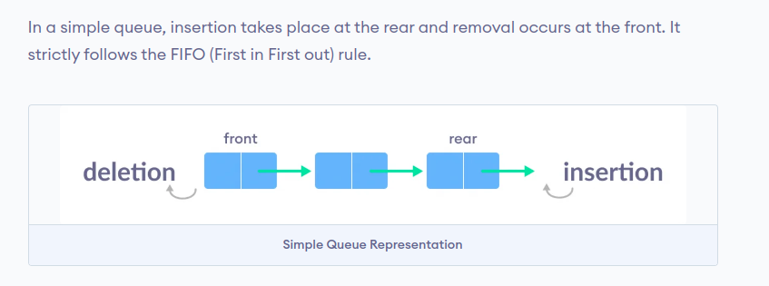
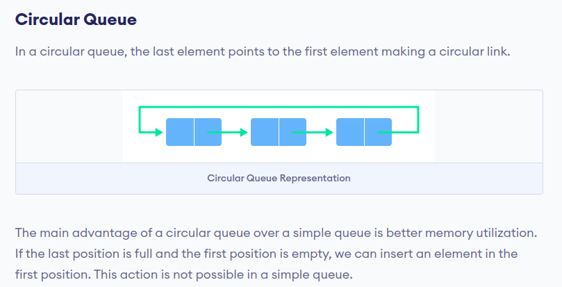
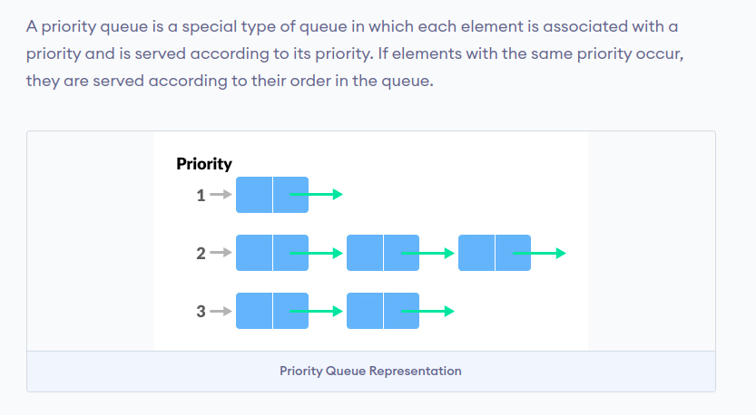
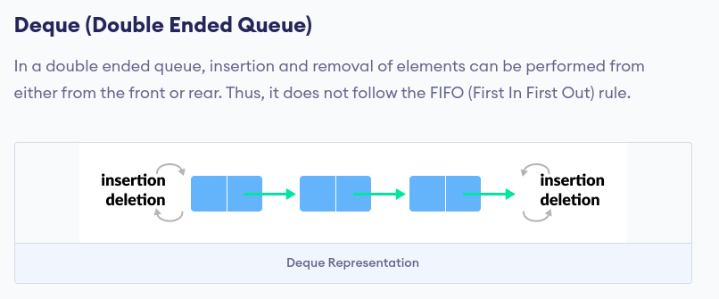

# Data-Structure-with-Python

## Stack :

## Queue :

### Types of Queue
There are four different types of queues:
- Simple Queue
- Circular Queue
- Priority Queue
- Double Ended Queue

## Simple Queue:

## Circular Queue:

## Priority Queue:

## Double Ended Queue:

#### Types of Deque : 
- Input Restricted Deque :-
  In this deque, input is restricted at a single end but allows deletion at both the ends.
- Output Restricted Deque :-
  In this deque, output is restricted at a single end but allows insertion at both the ends.
