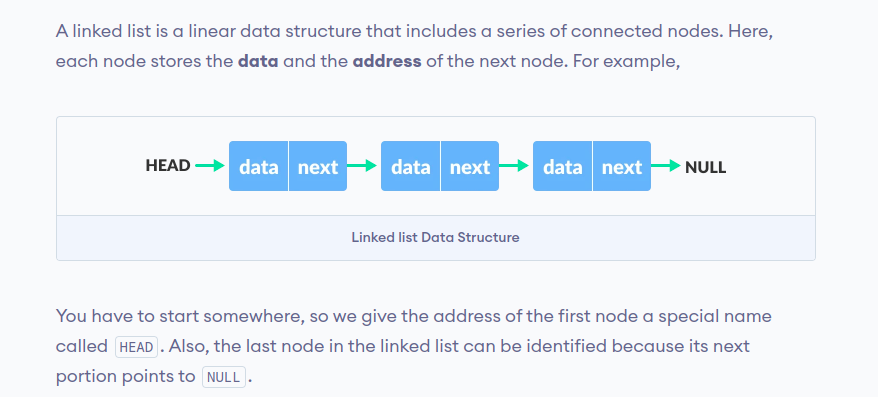

# Data-Structure-with-Python

## Stack :

## Queue :

### Types of Queue
There are four different types of queues:
- Simple Queue
- Circular Queue
- Priority Queue
- Double Ended Queue

## Simple Queue:

## Circular Queue:

## Priority Queue:

## Double Ended Queue:

#### Types of Deque : 
- Input Restricted Deque :-
  In this deque, input is restricted at a single end but allows deletion at both the ends.
- Output Restricted Deque :-
  In this deque, output is restricted at a single end but allows insertion at both the ends.

## Linked List:

### Linked List Operations: Traverse, Insert and Delete:
#### Here's a list of basic linked list operations that we will cover in this article :-

- Traversal - access each element of the linked list
- Insertion - adds a new element to the linked list
- Deletion - removes the existing elements
- Search - find a node in the linked list
- Sort - sort the nodes of the linked list

### Types of Linked List :
- Singly Linked List
- Doubly Linked List
- Circular Linked List

## Hash Table :

## Heap :

## Tree Data Structure : 

